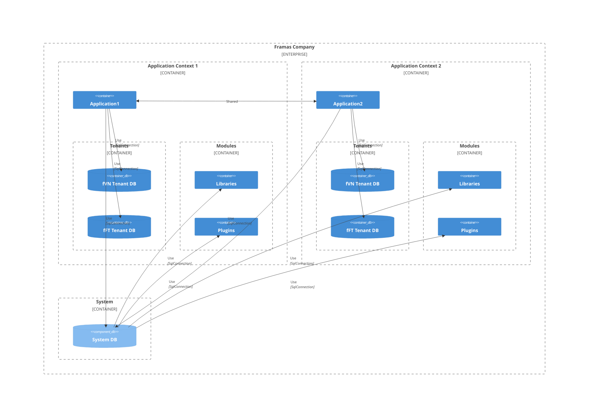

# Architecture

## Overview

Framas application architecture is built on the following principals and infrastructures:

* **Modularity**: Framas is designed to allow easily build true modular applications and systems. There are many pre-built module that i call is `Library`
and some module built by dev that i call is `Plugin`. Whith those modules we can easily plug-in and plug-out any module we want and increase the reusability of code.

* **Multi-App**: Imagine in Framas applications pool we might have many applications and each application will have and Id (AppId). In common each application will 
have independent resources. But at some point we might use some resources from another application. So with this architecture we can share resource across many application.

* **Multi-Tenancy**: Multi-Tenancy is a architecture to create SaaS applications where the hardware and software resources are shared by the companies (tenants).
Every company in Framas can be a tenant. So with this implement software can share data beetween each locations easily.
In Framas each company or data is identify by `mesocomp`. So in software we will do a same.

> One `Application` may have **many** `Tenants`  
> `Application` will acess to one `SystemDB`  
> `SystemDB` will store information about applications, tenants, plugins, libraries...

## Multi-App

## Multi-Tenancy

## Modularity

### 