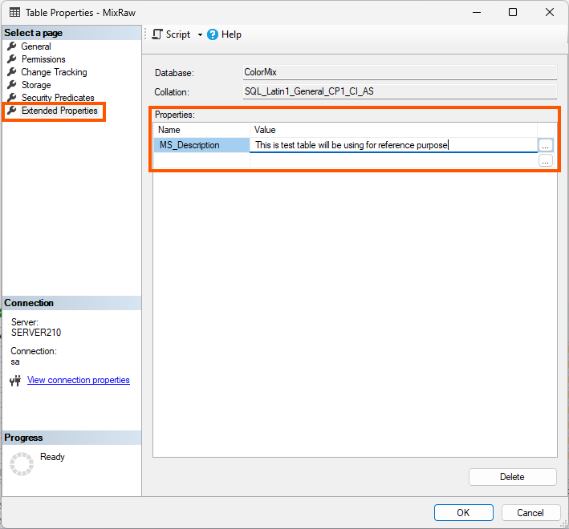
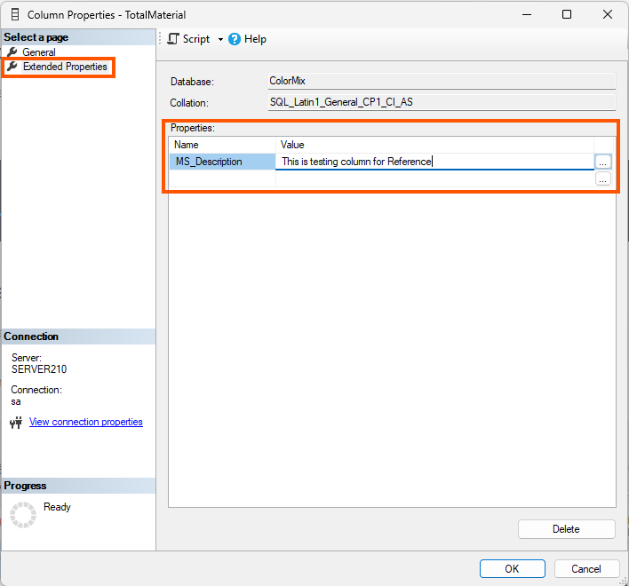
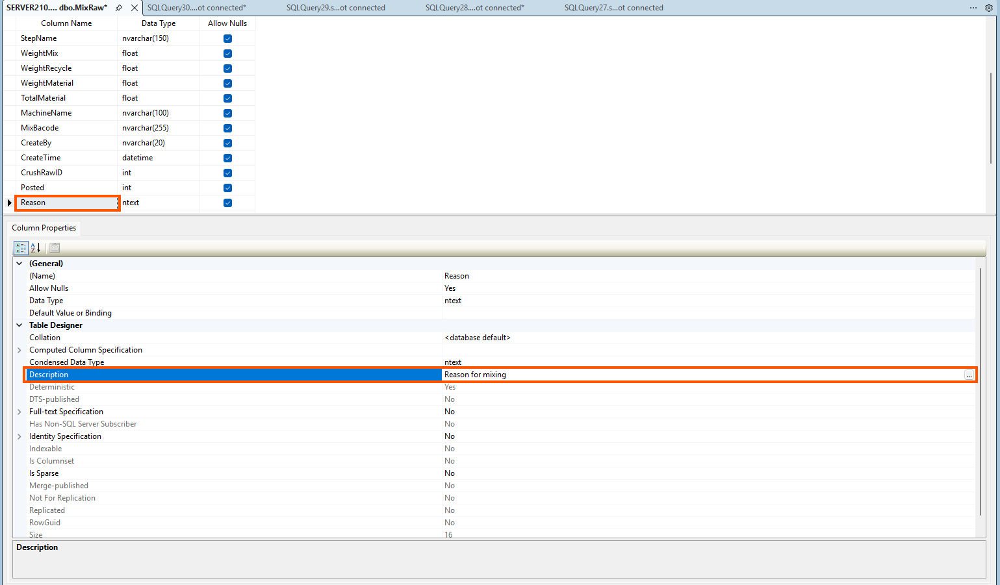
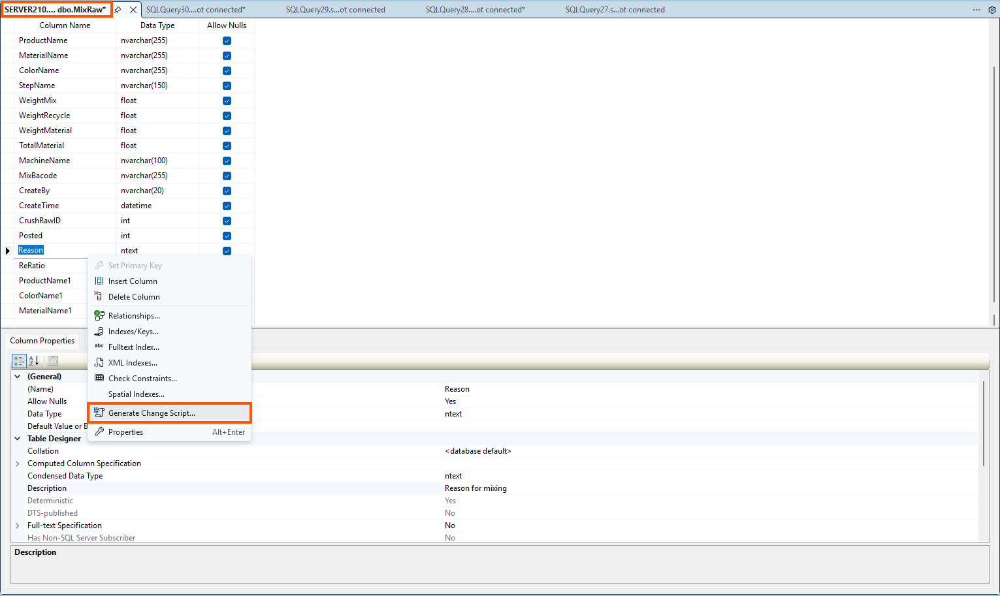
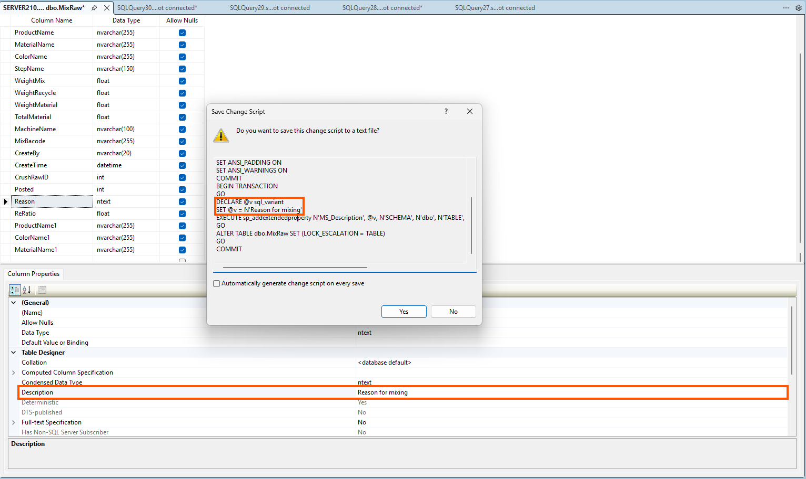

## 1. Rule
**"Code changes, Doc changes".**
Any changes to the Database schema (Table, Column, Type, Index) have to documentation update.

------------------------------
## 2. Execution Checklist
When there is a schema change or a description update, developers must follow this exact sequence:
## Step 1: Update Description in SSMS
Write descriptions directly into the database using Extended Properties in SQL Server Management Studio:

* Right-click on the Table or Column -> Select Properties.
* Select the Extended Properties tab.
* In the Name column, enter MS_Description. In the Value column, enter the business logic description.

(Figure 1: How to enter Column Description via Extended Properties)

------------------------------
## Step 2: Sync Schema and Update DBDocs
After finishing the updates on your local machine or staging environment:

2.1. Generate Change Script:

* In the Table Designer window (Right-click table -> Design), after making changes, do not click Save immediately.
* Right-click any empty space or a column -> Select "Generate Change Script...".

(Figure 2: Selecting Generate Change Script in Table Designer)

2.2. Sync Database:

* Copy the generated script.
* Paste and Run this script against the DOGE_WH_DEV database.

2.3. Finalize & Verify:

* Save all changes in your working database.
* Check the project's DBDocs link to ensure the information (new structure and descriptions) is displayed correctly.

------------------------------
## 3. Field Description Standards
Descriptions must be clear and focused on Business Logic rather than data types:

| Column Type | Description Requirement | Good Example |
|---|---|---|
| Status / Enum | List all values and their meanings | 0: Pending, 1: Approved, 2: Rejected |
| Foreign Key | Explain the relationship if the name is unclear | ID from Users table, identifies the creator |
| Flag (0/1) | Explain the toggle states | 1: Paid, 0: Unpaid |
| Calculated Col | Explain the calculation formula | Total = Price * Quantity - Discount |

------------------------------
## 4. Responsibility & Review

* Developer: Responsible for executing the task, writing descriptions, and ensuring DBDocs is up to date.
* Team Leader / Manager:
* Reject the task/PR if the Database schema has changed but DOGE_WH_DEV and DBDocs are not updated.
   * Review the quality and clarity of the descriptions.

------------------------------
💡 Project DBDocs Link: [dbdocs - framas](https://dbdocs.io/framas-vnm-system/Framas)
------------------------------
