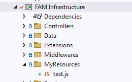

# Built In Libraries

## Shared

### Current App

This library provide functions to get the current application information.

In Winforms app we have only one application instance at the same time. But in AspNetCore app
may be we will have many application context that base on the user request.

#### ICurrentApp

`ICurrentApp` is the main interface to get info about the current application.

```cs
/// <summary>
/// Interface to get info about the current application
/// </summary>
public interface ICurrentApp 
{
    /// <summary>
    /// Indicate if the current context have the application info
    /// </summary>
    bool IsAvailable { get; }

    /// <summary>
    /// The current application info
    /// </summary>
    IAppInfo Info { get; }

    /// <summary>
    /// Changes the current application context
    /// </summary>
    /// <param name="appId">The application id</param>
    /// <returns></returns>
    IDisposable Change(string appId);
}

/// <summary>
/// Interface define the application info
/// </summary>
public interface IAppInfo
{
    /// <summary>
    /// The application identifier
    /// </summary>
    string Id { get; }

    /// <summary>
    /// The application name
    /// </summary>
    string? Name { get; }
}
```

#### How to Install

Add below packages into the project

```
<PackageReference Include="Framas.MultiApp" Version="8.0.0" />
```

#### How to Use

<!-- tabs:start -->

#### **Winforms**
```cs
public void Test()
{
    // Get ICurrentApp interface from DI container.
    ICurrentApp currentApp = FramasWinformsApp.GetRequiredService<ICurrentApp>();
        
    var id = currentApp.Info.Id;
    var name = currentApp.Info.Name;

    // Switch to another app context.
    using (var appContext = currentApp.Change("AnotherAppId"))
    {
        // Do something in another app context.
        // The code under this block will run in another app context.
    }

    // Switch back to the original app context.        
}
```
<!-- tabs:end -->

### Current Tenant

This library provide functions to get the current tenant information.

#### ICurrentTenant

`ICurrentTenant` is the main interface to get info about the current tenant.

```cs
/// <summary>
/// Interface to get info about the current tenant
/// </summary>
public interface ICurrentTenant
{
    /// <summary>
    /// Indicate if the current context have the tenant info
    /// </summary>
    bool IsAvailable { get; }    

    /// <summary>
    /// The mesocomp (Company identifier)
    /// </summary>
    string? MESOCOMP { get; }

    /// <summary>
    /// Change the current tenant context
    /// </summary>
    /// <param name="mesocomp">The company identifier</param>
    /// <returns></returns>
    IDisposable Change(string? mesocomp = null);

    /// <summary>
    /// Get the current mesocomp (Company identifier)
    /// </summary>
    /// <returns></returns>
    /// <exception cref="FramasException">Throw when current context do not have tenant info</exception>
    string MustGetMESOCOMP();

    /// <summary>
    /// Get the system connection info of the current tenant
    /// </summary>
    /// <returns></returns>
    IConnectionInfo? GetSystemConnectionInfo();

    /// <summary>
    /// Get the system connection info of the current tenant
    /// </summary>
    /// <returns></returns>
    Task<IConnectionInfo?> GetSystemConnectionInfoAsync(CancellationToken cancellationToken = default);

    /// <summary>
    /// Get the system connection info of the current tenant
    /// </summary>
    /// <returns></returns>
    /// <exception cref="FramasException">Throw when current context do not have tenant info</exception>
    IConnectionInfo MustGetSystemConnectionInfo();

    /// <summary>
    /// Get the system connection info of the current tenant
    /// </summary>
    /// <returns></returns>
    /// <exception cref="FramasException">Throw when current context do not have tenant info</exception>
    Task<IConnectionInfo> MustGetSystemConnectionInfoAsync(CancellationToken cancellationToken = default);

    /// <summary>
    /// Get the data connection info of the current tenant
    /// </summary>
    /// <returns></returns>
    IConnectionInfo? GetDataConnectionInfo();

    /// <summary>
    /// Get the data connection info of the current tenant
    /// </summary>
    /// <returns></returns>
    Task<IConnectionInfo?> GetDataConnectionInfoAsync(CancellationToken cancellationToken = default);

    /// <summary>
    /// Get the data connection info of the current tenant
    /// </summary>
    /// <returns></returns>
    /// <exception cref="FramasException">Throw when current context do not have tenant info</exception>
    IConnectionInfo MustGetDataConnectionInfo();

    /// <summary>
    /// Get the data connection info of the current tenant
    /// </summary>
    /// <returns></returns>
    /// <exception cref="FramasException">Throw when current context do not have tenant info</exception>
    Task<IConnectionInfo> MustGetDataConnectionInfoAsync(CancellationToken cancellationToken = default);
}
```

> The `Tenant` will contains 2 types of db connection info </br>
> * **SystemConnectionInfo**: 
> 

#### How to Install

Add below packages into the project

```
<PackageReference Include="Framas.MultiTenancy" Version="8.0.0" />
```

#### How to Use

<!-- tabs:start -->

#### **Winforms**
```cs
public void Test()
{
    // Get ICurrentTenant interface from DI container.
    ICurrentTenant currentTenant = FramasWinformsApp.GetRequiredService<ICurrentTenant>();

    var mesocomp = currentTenant.MESOCOMP;
    var systemConnectionInfo = currentTenant.GetSystemConnectionInfo();
    var dataConnectionInfo = currentTenant.GetDataConnectionInfo();

    // Switch to another app context.
    using (var fftContext = currentTenant.Change("fFT"))
    {
        // Do something in another tenant.
        // The code under this block will run in another tenant context.
    }

    // Switch back to the root tenant.     
}
```
<!-- tabs:end -->

### Current User

This library provide functions to get the current logged in user.

Framas use `ClaimsPrincipal` to identity and access management and describe about the user. </br>

The `ClaimsPrincipal` represents the user in an application and encapsulates all the `claims`-based identities associated with the user. It is a central part of the claims-based identity model, which is used for authentication and authorization in modern applications.

`Claim` is a key-value pair that represents a piece of information about a user. It is part of the `System.Security.Claims` namespace and is commonly used in identity and access management scenarios, such as authentication and authorization.

1.	Claim Types: These are predefined or custom strings that represent the type of information the claim holds. Common Framas claim types include (You can check in `FramasClaimTypes` class):
    * **ApplicationId**: Represents the user's belong to which application id.
    * **UserName**: Represents the UserName logged in.
    * **mesocomp**: Represents the user's tenant context.
    * **mesoyear**: Represents the company financial year.    
    * **Permission**: Represents the user's permission.
    * **EmployeeNo**: Represents the user's employee no.
    * **ClaimTypes.Name**: Represents the user's name.
    * **ClaimTypes.SurName**: Represents the user's sur name.
    * **ClaimTypes.Email**: Represents the user's email address.
    * **ClaimTypes.Role**: Represents the user's role.
    * **ClaimTypes.MobilePhone**: Represents the user's phone number.
    * **email_verified**: Represents the user was vertified by email.
    * **phone_number_verified**: Represents the user was vertified by phone number.
2.	Claim Value: This is the actual piece of information associated with the claim type. For example, if the claim type is ClaimTypes.Email, the claim value might be user@example.com.

#### ICurrentUser

```cs
/// <summary>
/// Interface to get the current user info
/// </summary>
public interface ICurrentUser
{
    /// <summary>
    /// Indicate if the current user is authenticated
    /// </summary>
    bool IsAuthenticated { get; }

    /// <summary>
    /// The user identifier
    /// </summary>
    [CanBeNull]
    Guid? Id { get; }

    /// <summary>
    /// The logged in UserName
    /// </summary>
    string? UserName { get; }

    /// <summary>
    /// The name of the user
    /// </summary>
    string? Name { get; }

    /// <summary>
    /// SurName of the user
    /// </summary>
    string? SurName { get; }

    /// <summary>
    /// The phone number of the user
    /// </summary>
    string? PhoneNumber { get; }

    /// <summary>
    /// Indicate if the phone number is verified
    /// </summary>
    bool PhoneNumberVerified { get; }

    /// <summary>
    /// The email of the user
    /// </summary>
    string? Email { get; }

    /// <summary>
    /// Indicate if the email is verified
    /// </summary>
    bool EmailVerified { get; }

    /// <summary>
    /// The mesocomp (Company identifier) of the logged user
    /// </summary>
    string? MESOCOMP { get; }

    /// <summary>
    /// The app id of the logged user
    /// </summary>
    string? AppId { get; }

    /// <summary>
    /// All the roles of the user
    /// </summary>
    [NotNull]
    string[] Roles { get; }

    /// <summary>
    /// Find first claim by claim type
    /// </summary>
    /// <param name="claimType"></param>
    /// <returns></returns>
    Claim? FindClaim(string claimType);

    /// <summary>
    /// Find all claims by claim type
    /// </summary>
    /// <param name="claimType"></param>
    /// <returns></returns>
    [NotNull]
    Claim[] FindClaims(string claimType);

    /// <summary>
    /// All the claims of the user
    /// </summary>
    /// <returns></returns>
    [NotNull]
    Claim[] GetAllClaims();

    /// <summary>
    /// Check if the user is in a role
    /// </summary>
    /// <param name="roleName"></param>
    /// <returns></returns>
    bool IsInRole(string roleName);

    /// <summary>
    /// Check if the user is in a permission
    /// </summary>
    /// <param name="permission"></param>
    /// <returns></returns>
    bool IsInPermission(string permission);
}
```

#### ICurrentPrincipalAccessor

Use `ICurrentPrincipalAccessor` if you want to access the origin `ClaimsPrincipal`

```cs
/// <summary>
/// Interface to get and change the current principal.
/// </summary>
public interface ICurrentPrincipalAccessor
{
    /// <summary>
    /// The current principal.
    /// </summary>
    ClaimsPrincipal Principal { get; }

    /// <summary>
    /// Changes the current principal.
    /// </summary>
    /// <param name="principal"></param>
    /// <returns></returns>
    IDisposable Change(ClaimsPrincipal principal);
}
```

#### How to Install

Add below packages into the project

```
<PackageReference Include="Framas.Security" Version="8.0.0" />
```

#### How to Use

<!-- tabs:start -->

#### **Winforms**
```cs
public void Test()
{
    // Get ICurrentUser interface from DI container.
    ICurrentUser currentUser = FramasWinformsApp.GetRequiredService<ICurrentUser>();

    // Get current user information.
    var username = currentUser.UserName;

    // Get ICurrentPrincipalAccessor interface from DI container.
    var currentPrincipalAccessor = FramasWinformsApp.GetRequiredService<ICurrentPrincipalAccessor>();
    var claimPrincipals = currentPrincipalAccessor.Principal;

    // Loop through all claims.
    foreach (var item in claimPrincipals.Claims)
    {
        // Do something with the claim.
    }

    // Switch to another ClaimPrincipal context.
    ClaimsPrincipal anotherClaimsPrincipal = new ClaimsPrincipal();

    using (var anotherCP = currentPrincipalAccessor.Change(anotherClaimsPrincipal))
    {
        // Do something in another ClaimPrincipal.
        // The code under this block will run in another ClaimPrincipal.
    }

    // Switch back to the origin ClaimPrincipal. 
}
```
<!-- tabs:end -->

### DB Connection Provider

The **Framas.DbConnectionProvider** implements the `IDbConnectionContainer` interface that provide functions to get the `DbConnection` object
based on specified **Name** and the current **AppId** and **mesocomp** 

The `IDbConnectionContainer` will find the db connection info that is is store in table `FT017` (class `Framas.DbConnectionProvider.FT017_DbConnectionInfo`) to create the `DbConnection` object

#### How to manage DBConnection

<!-- tabs:start -->

#### **Visual Studio**

> FramasVSIX is required. [Click here to learn how to install](/README?id=install-framasvsix).

Open Visual Studio and following below steps:

1. Open Visual Studio. Goto Extensions -> Framas -> ManageApplications
2. Select which location you want to modify DbConnection.
3. Click **DB Connections** on ribbon menu to open the form.
4. Create/Update/Delete db connection you want to.


<!-- tabs:end -->

#### Properties of DBConnection
- **Name**: The name of the db connection
- **DbProvider**: The database provider of the connection
    * mssql: Microsoft SQL Server
    * sqlite: SQLite
    * mysql: MySQL
    * npgsql: PostgreeSQL
- **ConnectionString**: The connection string
- **mesocomp**: The company identifier.
- **AppId**: The application identifier that db connection belong to.
- **Note**: Some note about the connection

#### How to Install

Add below packages into the project

```
<PackageReference Include="Framas.DbConnectionProvider" Version="8.0.0" />
```

#### How to Use

<!-- tabs:start -->

#### **AspNetCore**

```cs
using Dapper;
using Framas.DbConnectionProvider;
using Microsoft.AspNetCore.Mvc;

namespace ExampleControllers;

public class ExampleController1 : ControllerBase
{
    private readonly IDbConnectionContainer _dbConnContainer;

    public ExampleController1(IDbConnectionContainer dbConnContainer, IServiceProvider services)
    {
        // Get the IDbConnectionContainer service by dependency injection
        _dbConnContainer = dbConnContainer;

        // Or you can get by IServiceProvider
        _dbConnContainer = services.GetRequiredService<IDbConnectionContainer>();
    }

    [HttpGet]
    public ActionResult GetData()
    {
        // Create the DbConnection object by the connection name 'Connection1'
        DbConnection conn = dbConnContainer.CreateDbConnection("Connection1");

        // Execute the query
        var result = conn.Query("SELECT * FROM table");
        return Ok(result);
    }
}

```

#### **Winforms**

```cs
using Dapper;
using Framas.BootLoader.Winforms;
using Framas.DbConnectionProvider;
using System.Data.Common;

public void Execute()
{
    // Get the IDbConnectionContainer service
    var dbConnContainer = FramasWinformsApp.GetRequiredService<IDbConnectionContainer>();

    // Create the DbConnection object by the connection name 'Connection1'
    DbConnection conn = dbConnContainer.CreateDbConnection("Connection1");

    // Execute the query
    var result = conn.Query("SELECT * FROM table");
}
```

<!-- tabs:end  -->

#### IDbConnectionContainer

```cs
using System.Data.Common;
using System.Threading;
using System.Threading.Tasks;

namespace Framas.DbConnectionProvider;

/// <summary>
/// Interface for a container that manages database connections.
/// </summary>
public interface IDbConnectionContainer
{
    /// <summary>
    /// Creates a database connection with the specified name.
    /// </summary>
    /// <param name="name">The name of the connection.</param>
    /// <returns>A <see cref="DbConnection"/> object.</returns>
    DbConnection CreateDbConnection(string name);

    /// <summary>
    /// Creates a database connection with the specified name and MESOCOMP value.
    /// </summary>
    /// <param name="name">The name of the connection.</param>
    /// <param name="mesocomp">The MESOCOMP value.</param>
    /// <returns>A <see cref="DbConnection"/> object.</returns>
    DbConnection CreateDbConnection(string name, string mesocomp);

    /// <summary>
    /// Gets the connection information for the specified name.
    /// </summary>
    /// <param name="name">The name of the connection.</param>
    /// <returns>An <see cref="IDbConnectionInfo"/> object.</returns>
    IDbConnectionInfo GetConnectionInfo(string name);

    /// <summary>
    /// Gets the connection information for the specified name and MESOCOMP value.
    /// </summary>
    /// <param name="name">The name of the connection.</param>
    /// <param name="mesocomp">The MESOCOMP value.</param>
    /// <returns>An <see cref="IDbConnectionInfo"/> object.</returns>
    IDbConnectionInfo GetConnectionInfo(string name, string mesocomp);

    /// <summary>
    /// Asynchronously creates a database connection with the specified name.
    /// </summary>
    /// <param name="name">The name of the connection.</param>
    /// <param name="cancellationToken">A cancellation token.</param>
    /// <returns>A task that represents the asynchronous operation. The task result contains a <see cref="DbConnection"/> object.</returns>
    Task<DbConnection> CreateDbConnectionAsync(string name, CancellationToken cancellationToken = default);

    /// <summary>
    /// Asynchronously creates a database connection with the specified name and MESOCOMP value.
    /// </summary>
    /// <param name="name">The name of the connection.</param>
    /// <param name="mesocomp">The MESOCOMP value.</param>
    /// <param name="cancellationToken">A cancellation token.</param>
    /// <returns>A task that represents the asynchronous operation. The task result contains a <see cref="DbConnection"/> object.</returns>
    Task<DbConnection> CreateDbConnectionAsync(string name, string mesocomp, CancellationToken cancellationToken = default);

    /// <summary>
    /// Asynchronously gets the connection information for the specified name.
    /// </summary>
    /// <param name="name">The name of the connection.</param>
    /// <param name="cancellationToken">A cancellation token.</param>
    /// <returns>A task that represents the asynchronous operation. The task result contains an <see cref="IDbConnectionInfo"/> object.</returns>
    Task<IDbConnectionInfo> GetConnectionInfoAsync(string name, CancellationToken cancellationToken);

    /// <summary>
    /// Asynchronously gets the connection information for the specified name and MESOCOMP value.
    /// </summary>
    /// <param name="name">The name of the connection.</param>
    /// <param name="mesocomp">The MESOCOMP value.</param>
    /// <param name="cancellationToken">A cancellation token.</param>
    /// <returns>A task that represents the asynchronous operation. The task result contains an <see cref="IDbConnectionInfo"/> object.</returns>
    Task<IDbConnectionInfo> GetConnectionInfoAsync(string name, string mesocomp, CancellationToken cancellationToken);
}
```

### Config Storing

This library was built for manage any config data that was using by the application. The config will access by the **Name** of that config.

The library expose the `IConfigManager` and `IConfigContainer`. The `IConfigManger` will have many `IConfigContainer`. We have 2 built in `IConfigContainer`
that is `Local` and `Server`.

* `Local`: Read/write the config value at local machine
* `Server`: Read/write the config value at server db

> The config store in table `FT015` (class `FT015_Config`) 

```cs
public interface IConfigManager
{
    /// <summary>
    /// Config service to read/write the config value at local machine
    /// </summary>
    IConfigContainer Local { get; }

    /// <summary>
    /// Config service to read/write the config value store at the company db
    /// </summary>
    IConfigContainer Server { get; }

    /// <summary>
    /// Returns the custom config container
    /// </summary>
    /// <param name="containerName"></param>
    /// <returns></returns>
    IConfigContainer GetContainer(string containerName);
}


/// <summary>
/// The service to read/write the config value
/// </summary>
public interface IConfigContainer
{
    /// <summary>
    /// Asynchronously gets the configuration value for the specified key.
    /// </summary>
    /// <typeparam name="T">The type of the configuration value.</typeparam>
    /// <param name="context">The configuration context.</param>
    /// <param name="key">The key of the configuration value.</param>
    /// <param name="appId">The application ID (optional).</param>
    /// <param name="cancellationToken">The cancellation token (optional).</param>
    /// <returns>The configuration value, or null if not found.</returns>
    Task<T?> GetAsync<T>(ConfigContext context, string key, string? appId = null, CancellationToken cancellationToken = default);

    /// <summary>
    /// Gets the configuration value for the specified key.
    /// </summary>
    /// <typeparam name="T">The type of the configuration value.</typeparam>
    /// <param name="context">The configuration context.</param>
    /// <param name="key">The key of the configuration value.</param>
    /// <param name="appId">The application ID (optional).</param>
    /// <param name="cancellationToken">The cancellation token (optional).</param>
    /// <returns>The configuration value, or null if not found.</returns>
    T? Get<T>(ConfigContext context, string key, string? appId = null, CancellationToken cancellationToken = default);

    /// <summary>
    /// Asynchronously gets the configuration value for the specified key, or adds it if it does not exist.
    /// </summary>
    /// <typeparam name="T">The type of the configuration value.</typeparam>
    /// <param name="context">The configuration context.</param>
    /// <param name="key">The key of the configuration value.</param>
    /// <param name="valueFactory">The factory function to create the value if it does not exist.</param>
    /// <param name="encrypt">Whether to encrypt the value.</param>
    /// <param name="note">A note associated with the value (optional).</param>
    /// <param name="appId">The application ID (optional).</param>
    /// <param name="cancellationToken">The cancellation token (optional).</param>
    /// <returns>The configuration value.</returns>
    Task<T> GetOrAddAsync<T>(ConfigContext context, string key, Func<T> valueFactory, bool encrypt, string? note = null, string? appId = null, CancellationToken cancellationToken = default);

    /// <summary>
    /// Gets the configuration value for the specified key, or adds it if it does not exist.
    /// </summary>
    /// <typeparam name="T">The type of the configuration value.</typeparam>
    /// <param name="context">The configuration context.</param>
    /// <param name="key">The key of the configuration value.</param>
    /// <param name="valueFactory">The factory function to create the value if it does not exist.</param>
    /// <param name="encrypt">Whether to encrypt the value.</param>
    /// <param name="note">A note associated with the value (optional).</param>
    /// <param name="appId">The application ID (optional).</param>
    /// <param name="cancellationToken">The cancellation token (optional).</param>
    /// <returns>The configuration value.</returns>
    T GetOrAdd<T>(ConfigContext context, string key, Func<T> valueFactory, bool encrypt, string? note = null, string? appId = null, CancellationToken cancellationToken = default);

    /// <summary>
    /// Adds or updates the configuration value for the specified key.
    /// </summary>
    /// <typeparam name="T">The type of the configuration value.</typeparam>
    /// <param name="context">The configuration context.</param>
    /// <param name="key">The key of the configuration value.</param>
    /// <param name="value">The value to add or update.</param>
    /// <param name="encrypt">Whether to encrypt the value.</param>
    /// <param name="note">A note associated with the value (optional).</param>
    /// <param name="appId">The application ID (optional).</param>
    /// <param name="cancellationToken">The cancellation token (optional).</param>
    /// <returns>The added or updated configuration value.</returns>
    T AddOrUpdate<T>(ConfigContext context, string key, T value, bool encrypt, string? note = null, string? appId = null, CancellationToken cancellationToken = default);

    /// <summary>
    /// Asynchronously adds or updates the configuration value for the specified key.
    /// </summary>
    /// <typeparam name="T">The type of the configuration value.</typeparam>
    /// <param name="context">The configuration context.</param>
    /// <param name="key">The key of the configuration value.</param>
    /// <param name="value">The value to add or update.</param>
    /// <param name="encrypt">Whether to encrypt the value.</param>
    /// <param name="note">A note associated with the value (optional).</param>
    /// <param name="appId">The application ID (optional).</param>
    /// <param name="cancellationToken">The cancellation token (optional).</param>
    /// <returns>The added or updated configuration value.</returns>
    Task<T> AddOrUpdateAsync<T>(ConfigContext context, string key, T value, bool encrypt, string? note = null, string? appId = null, CancellationToken cancellationToken = default);

    /// <summary>
    /// Deletes the configuration value for the specified key.
    /// </summary>
    /// <param name="context">The configuration context.</param>
    /// <param name="key">The key of the configuration value.</param>
    /// <param name="appId">The application ID (optional).</param>
    /// <param name="cancellationToken">The cancellation token (optional).</param>
    /// <returns>The number of deleted entries.</returns>
    int Delete(ConfigContext context, string key, string? appId = null, CancellationToken cancellationToken = default);

    /// <summary>
    /// Asynchronously deletes the configuration value for the specified key.
    /// </summary>
    /// <param name="context">The configuration context.</param>
    /// <param name="key">The key of the configuration value.</param>
    /// <param name="appId">The application ID (optional).</param>
    /// <param name="cancellationToken">The cancellation token (optional).</param>
    /// <returns>The number of deleted entries.</returns>
    Task<int> DeleteAsync(ConfigContext context, string key, string? appId = null, CancellationToken cancellationToken = default);
}
```

#### How to Install

Add below packages into the project

```
<PackageReference Include="Framas.ConfigStoring" Version="8.0.0" />
```

#### How to Use

The config will have 3 different context.

The `ConfigContext` will indicate how the config value will store on the server.

* Global: Any one if it has the config key can access.
* User: The config that use for the current logged in user only.
* Machine: The config that use for the machine only.

```cs
/// <summary>
/// Represent the context of the configuration model
/// </summary>
[JsonConverter(typeof(JsonStringEnumConverter))]
public enum ConfigContext
{
    /// <summary>
    /// Indicate the context will store for machine
    /// </summary>
    Machine = 0,

    /// <summary>
    /// Indicate the context will store for user
    /// </summary>
    User = 1,

    /// <summary>
    /// Indicate the context will store for Global. Any one have the key can access this config
    /// </summary>
    Global = 2
}
```

<!-- tabs:start  -->

#### **Winforms**

```cs
public void Function() 
{
    // Get or create new MyDataObject if not exist.
    configManager.Server.GetOrAdd<MyDataObject>(
        ConfigContext.Global,                        // ConfigContext
        "MyDataObjectKey",                           // ConfigKey
        () => new MyDataObject(),                    // Value factory. Use to create new config object if it not exists.
        false,                                       // Indicate whether to encrypt the value. (On database)
        "Description");                              // Description of the config object.

    // Add or update MyDataObject if not exist.
    configManager.Server.AddOrUpdate(                // ConfigContext
        ConfigContext.Global,                        // ConfigKey
        "MyDataObjectKey",                           // Value factory. Use to create new config object if it not exists.|
        new MyDataObject(),                          // Indicate whether to encrypt the value. (On database)
        false, "Description");                       // Description of the config object.    
}
```

<!-- tabs:end  -->


### Virtual File System

The Virtual File System makes it possible to manage files that do not physically exist on the file system (disk). It's mainly used to embed (js, css, image..) files into assemblies and use them like physical files at runtime.

#### How to Install

Add below packages into the project

```
<PackageReference Include="Framas.VirtualFileSystem" Version="8.0.0" />
```

#### How to Use

**Embedding the Files**

A file should be first marked as embedded resource to embed the file into the assembly. The easiest way to do it is to select the file from the `Solution Explorer` and set `Build Action` to `Embedded Resource` from the Properties window. Example:


If you want to add multiple files, this can be tedious. Alternatively, you can directly edit your .csproj file:

```
<ItemGroup>
  <EmbeddedResource Include="MyResources\**\*.*" />
  <Content Remove="MyResources\**\*.*" />
</ItemGroup>
```

This configuration recursively adds all files under the MyResources folder of the project (including the files you will add in the future).

**Configure the services**
```cs
using Framas.VirtualFileSystem;

[assembly: ModuleDescriptor(typeof(MyModule), FramasAppType.AspNetCore, ModuleType.Plugin)]

public class MyModule : PluginModule
{
    public override Task ConfigureServicesAsync(ServiceConfigurationContext context)
    {
        // Configure the virtual file system.
        context.Services.AddFramasVirtualFileSystem(options =>
        {
            // Add all embedded files in this assembly contains type 'MyModule'
            // to the virtual file system.
            options.FileSets.AddEmbedded<MyPlugin>();            
        });
    }
}
```

**Get stream from file**

```cs
// Get the IVirtualFileProvider instance from the service provider.
var virtualFileProvider = serviceProvider.GetRequiredService<IVirtualFileProvider>();

// Get the test.js file from MyResources folder.
var file = virtualFileProvider.GetFileInfo("/ASSEMBLY_NAMESPACE/MyResources/test.js");

// Read all data as bytes from file
var dataBytes = await file.ReadBytesAsync();

// Read all data as string from file
var dataString = await file.ReadAsStringAsync();
```

> [!NOTE]
> The file path will combine form /`{The namespace contains the folder}`/`{Path To File}`/`{FileName}` </br>
> The `VirtualFileSystem` will split by `.` and turn into the folder </br>
> So the file path will replace all `.` by `/` </br>
> Example: </br>
>        </br>
> File path of the `test.js` = `/FAM.Infrastructure/MyResources/test.js`


### BLOB Storing

It is typical to store file contents in an application and read these file contents on need. Not only files, but you may also need to save various types of large binary objects, a.k.a. BLOBs, into a storage. For example, you may want to save user profile pictures.


A BLOB is a typically byte array. There are various places to store a BLOB item; storing in the local file system, in a shared database or on the Database BLOB storage can be options.

#### BLOB Storage Providers

* FileSystem: Stores BLOBs in a folder of the local file system, as standard files.
* Database: Stores BLOBs in a database.

Multiple providers can be used together by the help of the container system, where each container can uses a different provider.

> [!NOTE]
> BLOB storing system have default IBlobContainer using `Database` provider using current tenant database.

#### How to Install

Add below packages into the project

```
<PackageReference Include="Framas.BlobStoring" Version="8.0.0" />
```

#### IBlobContainer

`IBlobContainer` is the main interface to store and read BLOBs. Your application may have multiple containers and each container can be separately configured. But, there is a default container that can be simply used by injecting the `IBlobContainer`.

**Example**

```cs
namespace Demo
{
    public class MyService
    {
        private readonly IBlobContainer _blobContainer;

        public MyService(IBlobContainer blobContainer)
        {
            _blobContainer = blobContainer;
        }

        public async Task SaveBytesAsync(byte[] bytes)
        {
            await _blobContainer.SaveAsync("my-blob-1", bytes);
        }
        
        public async Task<byte[]> GetBytesAsync()
        {
            return await _blobContainer.GetBytesAsync("my-blob-1");
        }
    }
}
```

#### IBlobContainerFactory

`IBlobContainerFactory` is the service that is used to create the BLOB containers. One example was shown above.

```cs
var blobContainer = blobContainerFactory.Create("my-blob-container-name");

// or using IServiceProvider directly
var blobContainer2 = ServiceProvider.GetBlobContainer("my-blob-container-name-2");
```

#### Configuring the Containers

Containers should be configured before using them. The most fundamental configuration is to select a BLOB storage provider

```cs
using Framas.BlobStoring.Abstractions;
using Framas.BlobStoring.FileSystem;

 public override Task ConfigureServicesAsync(ServiceConfigurationContext context)
 {
     context.Services.AddFramasBlobStoring(opt =>
     {
        // Configure IBlobContainer with name 'Physical' using FileSystem provider
        opt.Containers.Configure("Physical", container => container.UseFileSystem((sp, provider) =>
        {
            provider.BasePath = "./physical";

            // provider.UseDomainAccount = true;
            // provider.DomainName = "";
            // provider.DomainUsername = "";
            // provider.DomainPassword = "";
        }));

        // Configure IBlobContainer with name 'Physical' using Database provider
        opt.Containers.Configure("Database", container => container.UseDatabase((sp, provider) =>
        {
            provider.ConnectionString = "YOUR_CONNECTION_STRING";
            provider.DbProvider = SystemDbProviders.SqlServer;
        }));
     });

     return base.ConfigureServicesAsync(context);
 }
```


## Winforms

### Security

---

## AspNetCore

### WORK IN PROGESS
